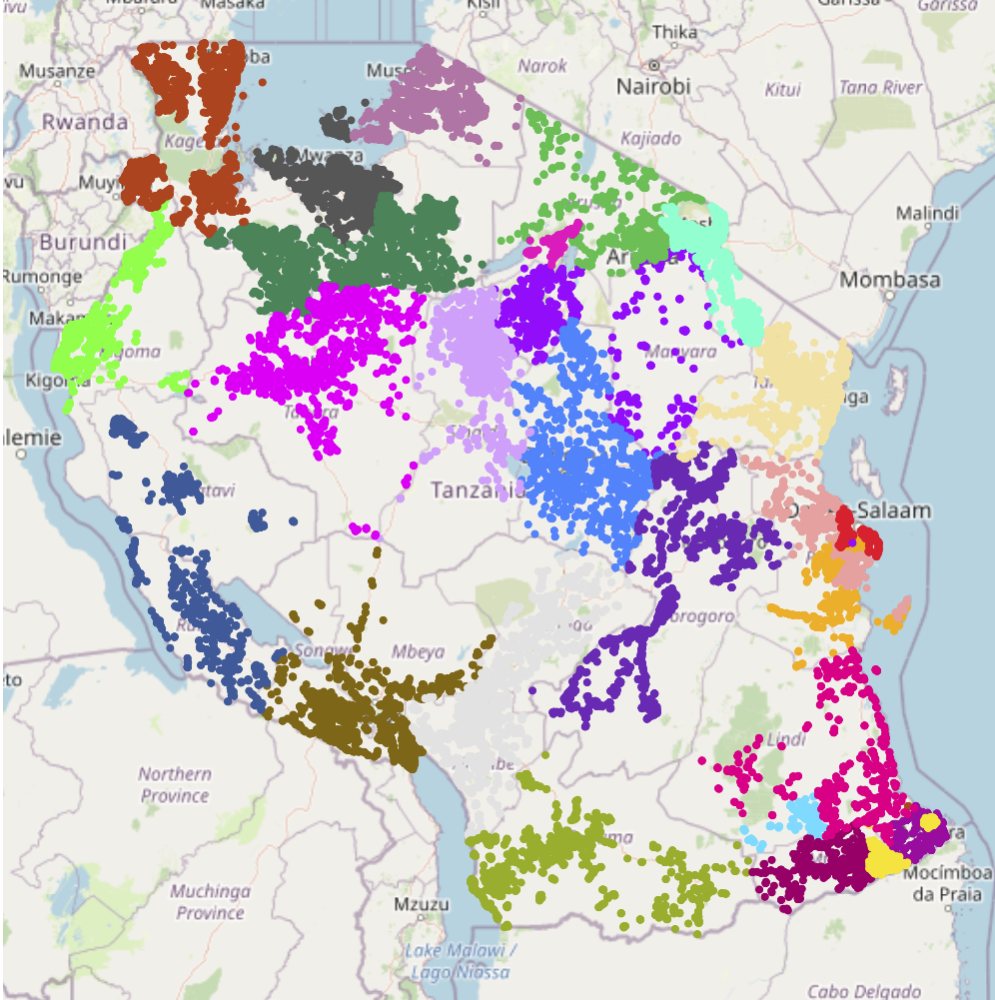
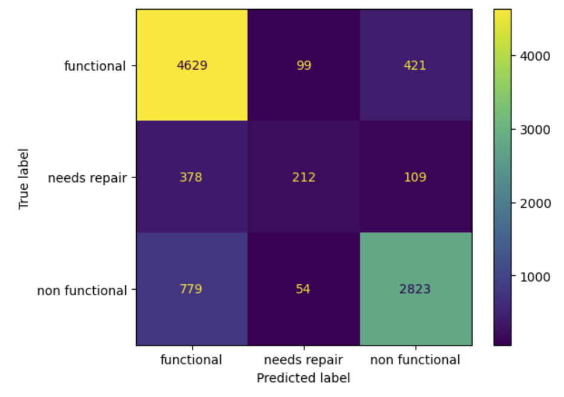

# Tanzanian Water Pump Predictive Model

This repository holds the data exploration and model testing used in a Kaggle competition to determine the status of various water pumps maintained by the Tanzanian Ministry of Water.

Various models were tested and compared, but sticking to decision trees and its variances. In the end, a gradient boosted decision tree was found to before the best, with an accuracy and precision of around 80%.

Notebooks are listed in order of exploration and model testing, with the final notebook containing attempts to improve the dataset itself.

## The various water pumps differentiated by region.

## Confusion Matrix of final Model

